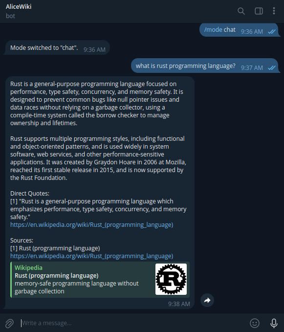
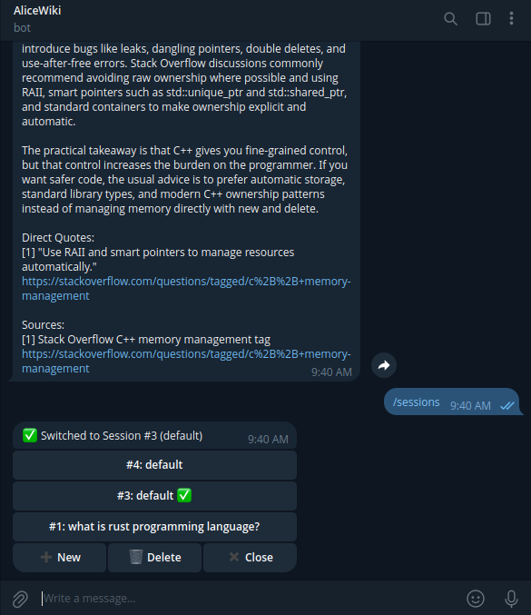

# AliceWiki Telegram Bot (SQLite)

A Telegram bot that fetches Wikipedia articles and Stack Overflow answers, with optional LLM support. Built with [Grammy](https://grammy.dev), [LangChain](https://js.langchain.com), [Express](https://expressjs.com) and [Bun](https://bun.sh).
 

## Requirements

- **Telegram Bot Token** 
- **OpenAI API Key** 

## Installation
> [!IMPORTANT]
> Setup the telegram bot first and get the bot token from BotFather 

### Docker (production)

```bash
# Linux / macOS
curl -O https://raw.githubusercontent.com/griimmv/alicetele-sqlite/main/docker-compose.yml

mkdir -p alicetele/data

curl -o ./alicetele/.env.local https://raw.githubusercontent.com/griimmv/alicetele-sqlite/main/.env.example

echo "WEBHOOK_SECRET=$(openssl rand -hex 32)" >> ./alicetele/.env.local

chmod 600 ./alicetele/.env.local

docker compose up -d
```

```powershell
# Windows
curl.exe -O https://raw.githubusercontent.com/griimmv/alicetele-sqlite/main/docker-compose.yml

mkdir alicetele/data -Force

curl.exe -o ./alicetele/.env.local https://raw.githubusercontent.com/griimmv/alicetele-sqlite/main/.env.example

powershell -c "$s=[System.Convert]::ToHexString([System.Security.Cryptography.RandomNumberGenerator]::GetBytes(32)).ToLower(); Add-Content ./alicetele/.env.local ('WEBHOOK_SECRET=' + $s)"

docker compose up -d
```

After all those, edit ./alicetele/.env.local and fill BOT_TOKEN, OPENAI_API_KEY, and WEBHOOK_URL.

### Git clone (development)

```bash
# 1. Clone repo
git clone https://github.com/griimmv/alicetele-sqlite.git && cd alicetele-sqlite
bun install

# 2. Generate ./alicetele/.env.local with a WEBHOOK_SECRET
bun run init-env

# 3. Configure these on ./alicetele/.env.local
BOT_TOKEN=your_bot_token
OPENAI_API_KEY=your_openai_key
```

**With ngrok:**
```bash
# 4. Get your ngrok auth token then do this
ngrok config add-authtoken <your_token>

# 5. Auto-starts ngrok + registers webhook url in-memory + init DB
bun run ngrok
```

**Without ngrok:**
```bash
# 4. Set WEBHOOK_URL in ./alicetele/.env.local to your public HTTPS URL
# 5. Then run it
bun run start
```


## Configuration

| Variable | Required | Default | Description |
|---|---|---|---|
| `BOT_TOKEN` | Yes | — | Telegram bot token from [@BotFather](https://t.me/botfather) |
| `OPENAI_API_KEY` | Yes | — | OpenAI API key |
| `DATABASE_PATH` | Yes | `./alicetele/data/alicewiki.db` | Path to SQLite database file |
| `PORT` | Yes | `3000` | Port for the Express server |
| `OPENAI_MODEL` | Yes | `gpt-5.4-mini` | OpenAI model name |
| `WEBHOOK_URL` | Yes | — | Public HTTPS URL for Telegram webhook (if you use ngrok, don't worry about this)|
| `WEBHOOK_SECRET` | Yes | — | Secret token to verify Telegram webhook requests (generated by `bun run init-env`) |

## Scripts 

| Command | Description |
|---|---|
| `bun run start` | Run bot in production (if you want to use your own domain, use this instead of run ngrok) |
| `bun run ngrok` | Start ngrok tunnel + run bot |
| `bun run dev` | Run bot with file watching |
| `bun run dev-ngrok` | Start ngrok tunnel + run bot with file watching |
| `bun run init-env` | Create `./alicetele/.env.local` with a generated `WEBHOOK_SECRET` |


## Architecture

```text
scripts/
├── init-ngrok.ts          ngrok tunnel launcher + runs /src/index.ts
└── init-env.ts            Generate ./alicetele/.env.local with WEBHOOK_SECRET (for dev)
src/
├── index.ts               Entry point — Express server, webhook registration, app bootstrap
├── lib/
│   └── config.ts          Env var loading and validation
├── bot/
│   ├── client.ts          Grammy Bot instance, webhook callback handler, setWebhook()
│   ├── handlers.ts        Telegram command and message handlers (mode dispatch, /start, /help, etc.)
│   ├── session.ts         Conversation history loading, export building, turn matching
│   ├── session-handler.ts Session management inline keyboard UI (/sessions)
│   └── tool-selector.ts   Tool selection keyboard, pending query store, tool callback dispatch
├── routes/
│   └── webhook.ts         Express router — POST /api/webhook
├── db/
│   ├── indexdb.ts           SQLite via bun:sqlite — init, session/turn CRUD, auto-migration
│   └── schema.sql         Reference SQL schema
└── engine/
    ├── agent.ts           LLM agent loop — invokes LLM with tools, retry logic, timeout handling
    ├── llm.ts             ChatOpenAI instantiation
    ├── parser.ts          Extract JSON from LLM text responses
    ├── tool-mode.ts       Direct (non-chat) tool execution pathway
    └── tools/
        ├── indextools.ts     Tool registry — tool definitions, lookup, and output formatting
        ├── stackexchange.ts  Stack Overflow search tool (Stack Exchange API v2.3)
        └── wikipedia.ts      Wikipedia search tool (LangChain tool schema, with fallback search)
```

### Data flow

```text
Telegram ── HTTPS ──> Domain ──> Express (port 3000)
                                  │
                                  └── /api/webhook ──> Grammy webhookCallback
                                                            │
                                                    bot.on("message:text")
                                                            │
                                                      getChatMode()
                                                            │
                                            ┌───────────────┴───────────────┐
                                            │                               │
                                        chat mode                     tool-only mode
                                            │                               │
                                        runAgent()                   setPendingQuery()
                                            │                         + show keyboard
                                    LangChain + OpenAI                      │
                                            │                       [user clicks button]
                                       toolRegistry                         │
                                     (fetch + search)                  runToolMode()
                                            │                      (toolRegistry.lookup)
                                            │                               │
                                            └───────────────┬───────────────┘
                                                            │
                                                       getOrCreateSession()
                                                            │
                                                        saveTurn()
```


### Database

SQLite file stored at `DATABASE_PATH` (default: `./alicetele/data/alicewiki.db`). Tables are auto-created on first run.

```sql
sessions: id | name | chat_id | archived | mode | created_at
   turns: id | session_id | turn_index | query | summary | quotes | sources | raw | error | input_tokens | output_tokens | created_at
```

- Each chat gets one active `session`. Using `/end` archives the current session and starts a new one.
- Each user query produces one `turn` linked to the active session, storing the LLM response, sources, and token usage.
- Archived sessions preserve full conversation history for `/export`.

## Commands

| Command | Description |
|---|---|
| `/start` | Welcome message and usage guide |
| `/help` | Show available commands |
| `/mode [chat\|tool]` | Toggle between chat (LLM-decides) and tool (manual pick) mode |
| `/sessions` | Switch, rename, or delete sessions |
| `/rename <name>` | Rename the current session |
| `/end` | Archive current session and start a fresh one |
| `/tokens` | Show input, output, and total token usage for the current session |
| `/export` | Export current session history as a JSON file. |
| Any text | Search Wikipedia or Stack Overflow via LLM (chat mode) or pick a tool manually (tool mode) |
